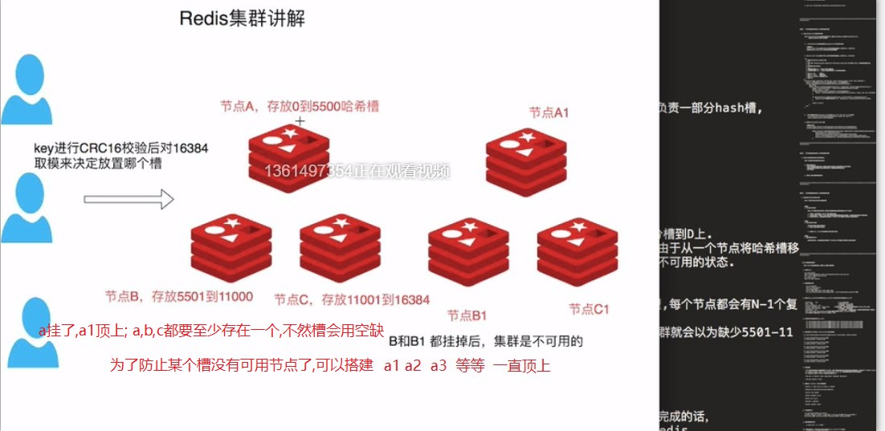
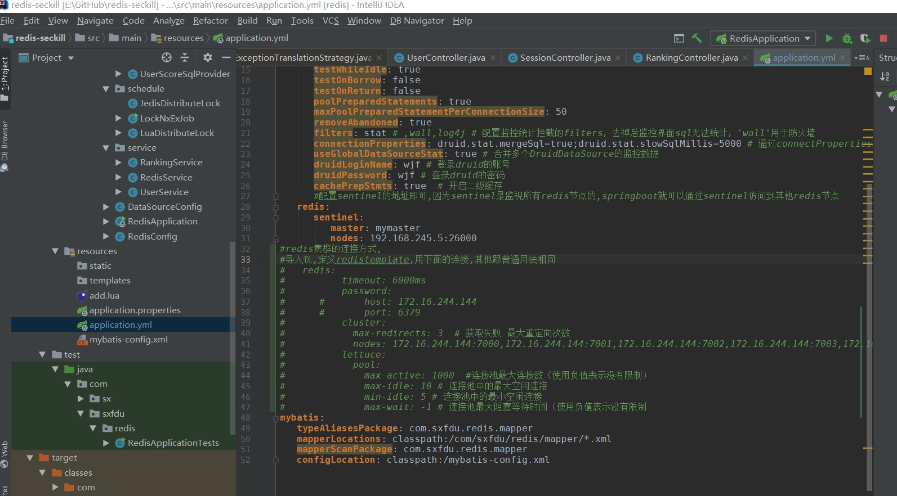
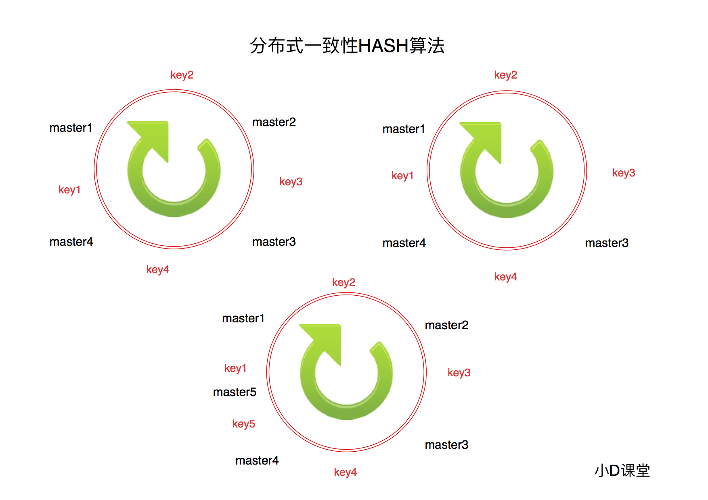
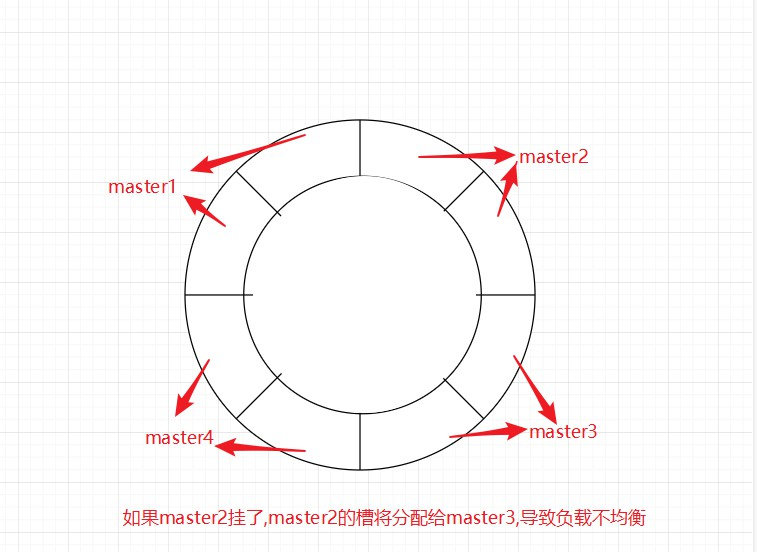
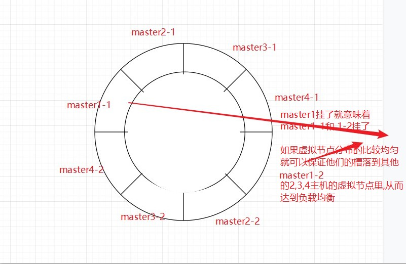

<!-- TOC -->

- [1. seckill-practice](#1-seckill-practice)
    - [1.1. 分布锁实现方案分析](#11-分布锁实现方案分析)
        - [1.1.1. redis分布式锁的使用场景](#111-redis分布式锁的使用场景)
        - [1.1.2. 面试分享高频大厂面试题之分布式系统高可用](#112-面试分享高频大厂面试题之分布式系统高可用)
        - [1.1.3. 灾备切换Sentinel的使用](#113-灾备切换sentinel的使用)
            - [1.1.3.1. docker搭建redis主从集群](#1131-docker搭建redis主从集群)
            - [1.1.3.2. docker 搭建redis-sentinel集群](#1132-docker-搭建redis-sentinel集群)
        - [sentinel简介](#sentinel简介)
        - [1.1.4. 互联网高可用灾备以及Sentinel三大任务讲解](#114-互联网高可用灾备以及sentinel三大任务讲解)
        - [1.1.5. Redis高可用Sentinel故障转移原理](#115-redis高可用sentinel故障转移原理)
        - [Redis集群不得不说的这点事](#redis集群不得不说的这点事)
- [附加:](#附加)
    - [Redis集群搭建](#redis集群搭建)
        - [Redis集群分片重哈希](#redis集群分片重哈希)
        - [Redis集群整合Springboot实战](#redis集群整合springboot实战)
        - [一致性Hash算法](#一致性hash算法)
        - [一致性Hash算法虚拟节点](#一致性hash算法虚拟节点)

<!-- /TOC -->

# 1. seckill-practice
秒杀项目实战  

难点:
+ 关于docker通信方式的redis集群
+ 分布式锁的实现

## 1.1. 分布锁实现方案分析

### 1.1.1. redis分布式锁的使用场景
* 分布式锁是什么

* * 分布式锁是控制分布式系统或不同系统之间共同访问共享资源的一种锁实现

  * 如果不同的系统或同一个系统的不同主机之间共享了某个资源时，往往通过互斥来防止彼此干扰。

* 分布锁设计目的

​         可以保证在分布式部署的应用集群中，同一个方法在同一操作只能被一台机器上的一个线程执行。

* 设计要求
  * 这把锁要是一把可重入锁（避免死锁）
  * 这把锁有高可用的获取锁和释放锁功能
  * 这把锁获取锁和释放锁的性能要好… 

* 分布锁实现方案分析    
  * 获取锁的时候，使用 setnx(SETNX key val:当且仅当 key 不存在时，set 一个 key 为 val 的字符串，返回 1;
  * 若 key 存在，则什么都不做，返回 【0】加锁，锁的 value 值为当前占有锁服务器内网IP编号拼接任务标识
  * 在释放锁的时候进行判断。并使用 expire 命令为锁添 加一个超时时间，超过该时间则自动释放锁。 
  * 返回1则成功获取锁。还设置一个获取的超时时间， 若超过这个时间则放弃获取锁。setex（key,value,expire）过期以秒为单位
  * 释放锁的时候，判断是不是该锁（即Value为当前服务器内网IP编号拼接任务标识），若是该锁，则执行 delete 进行锁释放


### 1.1.2. 面试分享高频大厂面试题之分布式系统高可用

**redis高可用的探索，剖析高可用解决方案**

- 高可用的概念？

  - 高可用HA（High Availability）是分布式系统架构设计中必须考虑的因素之一，它通常是指，通过设计减少系统不能提供服务的时间。
    

    

- 通过三大要点解释高可用:

  ****************

  - 单点是系统高可用的大敌，应该尽量在系统设计的过程中避免单点

  - 保证系统高可用，架构设计的核心准则是：冗余。

  - 每次出现故障需要人工介入恢复势必会增加系统的不可服务实践,实现自动故障转移

  - 重启服务，看服务是否每次都获取锁失败   
------

​     

- 分布式高可用经典架构环节分析

    

  - 【客户端层】到【反向代理层】的高可用，是通过反向代理层的冗余来实现的。以nginx为例：有两台nginx，一台对线上提供服务，另一台冗余以保证高可用， 常见的实践是keepalived存活探测
  - 【反向代理层】到【web应用】的高可用，是通过站点层的冗余来实现的。假设反向代理层是nginx，nginx.conf里能够配置多个web后端，并且nginx能够探测到多个后端的存活性。
    * 自动故障转移：当web-server挂了的时候，nginx能够探测到，会自动的进行故障转移，将流量自动迁移到其他的web-server，整个过程由nginx自动完成，对调用方是透明的。

  * 【服务层】到【缓存层】的高可用，是通过缓存数据的冗余来实现的。
              redis天然支持主从同步，redis官方也有sentinel哨兵机制，来做redis的存活性检测。
  * 【服务层】到【数据库层】的高可用，数据库层用“主从同步，读写分离”架构，所以数据库层的高可用，又分为“读库高可用”与“写库高可用”两类。
    * 读库采用冗余的方式实现高可用，写库采用keepalived存活探测   binlog进行同步


### 1.1.3. 灾备切换Sentinel的使用

**简介：互联网服务灾备故障转移，sentinel的配置**

#### 1.1.3.1. docker搭建redis主从集群
[docker搭建redis主从集群](https://blog.csdn.net/qq_28804275/article/details/80907796)  
[容器之间软连接通信](https://www.9ge6.com/archives/392.html)  
[容器之间的四种通信方式](https://www.cnkirito.moe/docker-network-bridge/)  
[link的底层原理](https://www.jianshu.com/p/21d66ca6115e)  
改进点:
+ redis.conf的protected mode 关闭,不然会导致spring boot 访问失败
+ 同一主机的docker容器间的访问(redis里面设置127.0.0.1 会识别成自己容器内的网址,而不是宿主机的网址),创建slave容器的时候应该是`docker run --link redis-master:redis-master  -it --name redis-slave -v /root/:/usr/local/etc/redis -d -p 6301:6379 redis /bin/bash`,使用--link就可以使主从容器之间  
+  redis-slave.conf 里面的slaveof masterport使用master容器内部port 6379即可,不要用绑定到外部的port  

#### 1.1.3.2. docker 搭建redis-sentinel集群
[docker搭建redis-sentinel集群](https://cloud.tencent.com/developer/article/1343834)  
改进点: 
+ 运行sentinel的时候把26000端口暴露出来,以供外界访问  
docker run -it --name redis-sentienl0container `-p 26000:26000 ` -v /root/:/usr/local/etc/redis/ -d  redis:4.0 /bin/bash

+ 自定义sentinel.conf的时候, master ip不要写localhost或者127.0.0.1 ; 而是要写服务器所在局域网的ip,比如 192.168.245.4;这样spring boot 通过sentinel连接redis节点的时候,就不会出现连接127.0.0.1:6300而找不到redis节点.

### sentinel简介

* `Redis`主从复制可将主节点数据同步给从节点，从节点此时有两个作用：

  - 一旦主节点宕机，从节点作为主节点的备份可以随时顶上来。
  - 扩展主节点的读能力，分担主节点读压力。

  但是问题来了：

  - 一旦主节点宕机，从节点晋升成主节点，同时需要修改应用方的主节点地址，还需要命令所有从节点去复制新的主节点，整个过程需要人工干预。

- redis主节点挂掉之后应该怎么操作？命令模拟

  ```shell
   slaveof no one       # 取消主备，变更为主节点
  
   slaveof 新host  新节点  # 将其他节点设置为新主节点的备份节点
  ```

- Sentinel正是实现了这个功能

- 开启Sentinel配置       3主3从   3主6从

  ```powershell
  sentinel monitor mymaster 127.0.0.1 6379 1   
  sentinel down-after-milliseconds mymaster 10000
  sentinel failover-timeout mymaster 60000
  sentinel parallel-syncs mymaster 1
  
  ```

    

- 命令讲解

  * sentinel monitor mymaster 127.0.0.1 6379 1 名称为mymaster的主节点名，1表示将这个主服务器判断为失效至少需要 1个 Sentinel 同意 （只要同意 Sentinel 的数量不达标，自动故障迁移就不会执行）
  * down-after-milliseconds 选项指定了 Sentinel 认为服务器已经断线所需的毫秒数
  *  failover过期时间，当failover开始后，在此时间内仍然没有触发任何failover操作，当前sentinel  将会认为此次failoer失败
  * parallel-syncs 选项指定了在执行故障转移时， 最多可以有多少个从服务器同时对新的主服务器进行同步， 这个数字越小， 完成故障转移所需的时间就越长。  
  * 如果从服务器被设置为允许使用过期数据集， 那么你可能不希望所有从服务器都在同一时间向新的主服务器发送同步请求,即parallel-syncs mymaster 设置的过大,虽然这会让故障转移时间变长;  因为尽管复制过程的绝大部分步骤都不会阻塞从服务器， 但从服务器在载入主服务器发来的 RDB 文件时， 仍然会造成从服务器在一段时间内不能处理命令请求： 如果全部从服务器一起对新的主服务器进行同步， 那么就可能会造成所有从服务器在短时间内全部不可用的情况出现。

- 启动所有主从上的sentinel   

  *  前提是它们各自的server已成功启动
        cd /usr/local/redis/src/redis-sentinel /etc/redis/sentinel.conf

- info Replication  查看节点信息

- shutdown主节点看服务是否正常


### 1.1.4. 互联网高可用灾备以及Sentinel三大任务讲解

**简介：互联网冷备和热备讲解，Sentinel是怎么工作的？Sentinel三大工作任务是什么？**

- Sentinel三大工作任务 

  - 监控（Monitoring）： Sentinel 会不断地检查你的主服务器和从服务器是否运作正常。
  - 提醒（Notification）： 当被监控的某个 Redis 服务器出现问题时， Sentinel 可以通过 API 向管理员或者其他应用程序发送通知。      
  - 自动故障迁移（Automatic failover）： 当一个主服务器不能正常工作时， Sentinel 会开始一次自动故障迁移操作， 它会将失效主服务器的其中一个从服务器升级为新的主服务器， 并让失效主服务器的其他从服务器改为复制新的主服务器； 当客户端试图连接失效的主服务器时， 集群也会向客户端返回新主服务器的地址， 使得集群可以使用新主服务器代替失效服务器。
    

- 互联网冷备和热备讲解，冷备和热备的特点分析

  * 冷备  

    *  概念：冷备份发生在数据库已经正常关闭的情况下，当正常关闭时会提供给我们一个完整的数据库
    * 优点：
      * 是非常快速的备份方法（只需拷文件）
      *  低度维护，高度安全
    * 缺点：
      - 单独使用时，只能提供到“某一时间点上”的恢复
      - 再实施备份的全过程中，数据库必须要作备份而不能作其他工作。也就是说，在冷备份过程中，数据库必须是关闭状态

  * 热备

    *   概念：热备份是在数据库运行的情况下，采用archivelog mode方式备份数据库的方法      

    *   优点：
      * 备份的时间短
      * 备份时数据库仍可使用
      * 可达到秒级恢复
    *  缺点  
      * 若热备份不成功，所得结果不可用于时间点的恢复
      * 因难于维护，所以要非凡仔细小心


### 1.1.5. Redis高可用Sentinel故障转移原理

**简介：Sentinel是怎么工作的？**

- 主观下线：

  - 概念主观下线（Subjectively Down， 简称 SDOWN）指的是单个 Sentinel 实例对服务器做出的下线判断

  - 主管下线特点：

    * 如果一个服务器没有在 master-down-after-milliseconds 选项所指定的时间内， 对向它发送 PING 命令的 Sentinel 返回一个有效回复（valid reply）， 那么 Sentinel 就会将这个服务器标记为主观下线

    * 服务器对 PING 命令的有效回复可以是以下三种回复的其中一种：

         ```shell
         返回 +PONG 。
         返回 -LOADING 错误。
         返回 -MASTERDOWN 错误。
         ```

- 客观下线

  - 客观下线概念：

    * 指的是多个 Sentinel 实例在对同一个服务器做出 SDOWN 判断， 并且通过 SENTINEL is-master-down-by-addr 命令互相交流之后， 得出的服务器下线判断。 （一个 Sentinel 可以通过向另一个 Sentinel 发送 SENTINEL is-master-down-by-addr 命令来询问对方是否认为给定的服务器已下线。）

  - 客观下线特点：

    * 从主观下线状态切换到客观下线状态并没有使用严格的法定人数算法（strong quorum algorithm）， 而是使用了流言协议： 如果 Sentinel 在给定的时间范围内， 从其他 Sentinel 那里接收到了足够数量的主服务器下线报告， 那么 Sentinel 就会将主服务器的状态从主观下线改变为客观下线。 如果之后其他 Sentinel 不再报告主服务器已下线， 那么客观下线状态就会被移除。

  - 客观下线注意点：

    * 客观下线条件只适用于主服务器： 对于任何其他类型的 Redis 实例， Sentinel 在将它们判断为下线前不需要进行协商， 所以从服务器或者其他 Sentinel 永远不会达到客观下线条件。 
    * 只要一个 Sentinel 发现某个主服务器进入了客观下线状态， 这个 Sentinel 就可能会被其他 Sentinel 推选出， 并对失效的主服务器执行自动故障迁移操作。


###   Redis集群不得不说的这点事

**简介：Redis集群特点介绍**

- Redis 集群的数据分片

  * 概念：Redis 集群有16384个哈希槽,每个key通过CRC16校验后对16384取模来决定放置哪个槽.集群的每个节点负责一部分hash槽,

  * 举个例子,比如当前集群有3个节点,那么: 
    * 节点 A 约包含 0 到 5500号哈希槽.
    * 节点 B 约包含5501 到 11000 号哈希槽.
    * 节点 C 约包含11001 到 16384号哈希槽.  
  * 查看集群信息redis-cli -p 7000 cluster nodes | grep master
    * 这种结构很容易添加或者删除节点. 比如如果我想新添加个节点D, 我需要从节点 A, B, C中得部分槽到D上. 如果我想移除节点A,需要将A中的槽移到B和C节点上,然后将没有任何槽的A节点从集群中移除即可. 由于从一个节点将哈希槽移动到另一个节点并不会停止服务,所以无论添加删除或者改变某个节点的哈希槽的数量都不会造成集群不可用的状态.


    

  - 从Redis宕机讲解分布式锁执行的异常场景流程

  - 从Server服务宕机讲解分布式锁执行的异常场景流程

    

- Redis 集群的主从复制模型(**异步复制**)

  

  - 为了使在部分节点失败或者大部分节点无法通信的情况下集群仍然可用，所以集群使用了主从复制模型,每个节点都会有N-1个复制品.  在我们例子中具有A，B，C三个节点的集群,在没有复制模型的情况下,如果节点B失败了，那么整个集群就会以为缺少5501-11000这个范围的槽而不可用.Redis集群做主从备份解决了这个问题  

    

- Redis 一致性保证  

  - 主节点对命令的复制工作发生在返回命令回复之后， 因为如果每次处理命令请求都需要等待复制操作完成的话， 那么主节点处理命令请求的速度将极大地降低 —— 我们必须在性能和一致性之间做出权衡。 注意：Redis 集群可能会在将来提供同步写的方法。 Redis 集群另外一种可能会丢失命令的情况是集群出现了网络分区， 并且一个客户端与至少包括一个主节点在内的少数实例被孤立。

    

- 手把手测试故障转移

  ```shell
  redis-cli -p 7000 debug segfault
  redis-cli -p 7001 cluster nodes | grep master


# 附加:
##   Redis集群搭建

**简介：Redis集群搭建实战**

- 安装redis

  * 处理步骤

  ```shell
  cd /usr/local/
  wget http://download.redis.io/releases/redis-4.0.6.tar.gz
  tar -zxvf redis-4.0.6.tar.gz
  cd redis-4.0.6
  make && make install
  ```

  

- 新建集群文件夹

  

  - 处理步骤

    ```shell
    cd /usr/local/
    mkdir redis_cluster
    cd redis_cluster
    mkdir 7000 7001 7002 7003 7004 7005
    cp /usr/local/redis-4.0.6/redis.conf  /usr/local/redis_cluster/7000  
    ```

    


- 修改redis_cluster/7000到redis_cluster/7005文件夹下面的Redis.conf

  *  处理步骤

```shell
daemonize    yes                          //redis后台运行
port  7000                                //端口7000,7002,7003
cluster-enabled  yes                      //开启集群  把注释#去掉
cluster-config-file  nodes.conf      //集群的配置  配置文件首次启动自动生成 7000,7001,7002
cluster-node-timeout  5000                //请求超时  设置5秒够了
appendonly  yes                           //aof日志开启  有需要就开启，它会每次写操作都记录一条日志
bind 127.0.0.1 172.16.244.144(此处为自己内网的ip地址，centos7下面采用ip addr来查看，其他系统试一下ifconfig查看，ip为)

```


- 在其他节点也修改完Redis.conf

  ​     

  * 处理步骤    

  ```shell
  cp /usr/local/redis_cluster/7000/redis.conf /usr/local/redis_cluster/7001
  cp /usr/local/redis_cluster/7000/redis.conf /usr/local/redis_cluster/7002
  cp /usr/local/redis_cluster/7000/redis.conf /usr/local/redis_cluster/7003
  cp /usr/local/redis_cluster/7000/redis.conf /usr/local/redis_cluster/7004
  cp /usr/local/redis_cluster/7000/redis.conf /usr/local/redis_cluster/7005
  
  ```


- 启动所有redis节点cd redis-server所在的路径

    * 处理步骤

    ```shell
    cp /usr/local/redis-4.0.6/src/redis-server /usr/local/ redis-cluster
    
    cd /usr/local/redis_cluster/7000 ../redis-server ./redis.conf
            
    cd /usr/local/redis-cluster/7001 ../redis-server ./redis.conf
            
    cd /usr/local/redis-cluster/7002 ../redis-server ./redis.conf
     
    cd /usr/local/redis-cluster/7003 ../redis-server ./redis.conf
            
    cd /usr/local/redis-cluster/7004 ../redis-server ./redis.conf
     
    cd /usr/local/redis-cluster/7005 ../redis-server ./redis.conf
    ```

     

- 创建集群

  * 前面已经准备好了搭建集群的redis节点，接下来我们要把这些节点都串连起来搭建集群。官方提供了一个工具：redis-trib.rb(/usr/local/redis-4.0.6/src/redis-trib.rb) 看后缀就知道这鸟东西不能直接执 行，它是用ruby写的一个程序，所以我们还得安装ruby.

  ```shell
    yum -y install ruby ruby-devel rubygems rpm-build 
             
    gem install redis
  ```


  ​     

- 如果gem install redis发现报错

    ```shell
    curl -L get.rvm.io | bash -s stable 
    
    source /usr/local/rvm/scripts/rvm
    
    rvm list known
    
    rvm install 2.3.3
    
    rvm use 2.3.3
    
    ruby --version
    
    gem install redis
    ```


​         

- 开启集群工作 

     ```shell
     cd /usr/local/redis-4.0.6/src
     ./redis-trib.rb create --replicas 1 127.0.0.1:7000 127.0.0.1:7001 \
           127.0.0.1:7002 127.0.0.1:7003 127.0.0.1:7004 127.0.0.1:7005
     
     ```

- 测试集群是否正常

     ```
     ./redis-cli -c -p 7000 
     ```

- 如果搭建失败，请用此命令将所有启动的redis server一个个关闭掉

     ```
     ./redis-cli -p 7000 shutdown
     ```


###  Redis集群分片重哈希

**简介：玩转Redis集群节点分片重哈希**

- 采用SSH连接远程服务器

  - ssh命令安装过程：https://blog.csdn.net/DanielAntony/article/details/87997574

    

- 集群重新分片

     手动处理solt节点槽重新分片

  - ./redis-trib.rb reshard 127.0.0.1:7000
  - 你想移动多少个槽( 从1 到 16384)?  all


- 添加一个新的主节点

     

  ```
  ./redis-trib.rb add-node 127.0.0.1:7006 127.0.0.1:7000
  ```

  

- 添加一个新的从节点

  ```
  ./redis-trib.rb add-node --slave 127.0.0.1:7006 127.0.0.1:7000
  ```

  

- 移除一个节点

   ./redis-trib.rb del-node 127.0.0.1:7000 `<node-id>`
    第一个参数是任意一个节点的地址,第二个节点是你想要移除的节点地址。

  * 移除主节点【先确保节点里面没有slot】
    * 使用同样的方法移除主节点,不过在移除主节点前，需要确保这个主节点是空的. 如果不是空的,需要将这个节点的数据重新分片到其他主节点上.
    * 替代移除主节点的方法是手动执行故障恢复，被移除的主节点会作为一个从节点存在，不过这种情况下不会减少集群节点的数量，也需要重新分片数据.

  * 移除从节点  直接移除成功


### Redis集群整合Springboot实战

**简介：Redis集群整合springboot讲解**

- 介绍

  - 大多数用户可能会使用RedisTemplate它及其相应的包org.springframework.data.redis.core- 由于其丰富的功能集，该模板实际上是Redis模块的中心类。该模板为Redis交互提供了高级抽象。虽然RedisConnection提供了接受和返回二进制值（byte数组）的低级方法，但模板负责序列化和连接管理，使用户无需处理这些细节。

    

- 引入spring-data-redis pom依赖  

  ```java
  <dependency>
      <groupId>org.springframework.boot</groupId>
      <artifactId>spring-boot-starter-data-redis</artifactId>
  </dependency>
  ```

  


- 引入redistemplate

  * 引入bean redisTemplate的使用，类型于：monogoTemplate、jdbcTemplate数据库连接工具
  * 编写redisTemplate类，设置redisConnectFactory

  

- 配置yml配置文件




###  一致性Hash算法

**简介：一起来进行Redis集群探索**

  2的32次方进行hash取模     0到2的32次方-1

- jedis分布式之 ShardedJedisPool （一致性Hash分片算法）

- 概念：

    分布式系统中负载均衡的问题时候可以使用Hash算法让固定的一部分请求落到同一台服务器上，这样每台服务器固定处理一部分请求（并维护这些请求的信息），起到负载均衡的作用

- 做法：



  * hash环上顺时针从整数0开始，一直到最大正整数，我们根据四个ip计算的hash值肯定会落到这个hash环上的某一个点，至此我们把服务器的四个ip映射到了一致性hash环
  * 当用户在客户端进行请求时候，首先根据hash(用户id)计算路由规则（hash值），然后看hash值落到了hash环的那个地方，根据hash值在hash环上的位置顺时针找距离最近的ip作为路由ip
  * 当用户在客户端进行请求时候，首先根据hash(用户id)计算路由规则（hash值），然后看hash值落到了hash环的那个地方，根据hash值在hash环上的位置顺时针找距离最近的ip作为路由ip.


-    一致性hash的特性

  * 单调性(Monotonicity)，单调性是指如果已经有一些请求通过哈希分派到了相应的服务器进行处理，又有新的服务器加入到系统中时候，应保证原有的请求可以被映射到原有的或者新的服务器中去，而不会被映射到原来的其它服务器上去。 

  * 分散性(Spread)：分布式环境中，客户端请求时候可能不知道所有服务器的存在，可能只知道其中一部分服务器，在客户端看来他看到的部分服务器会形成一个完整的hash环。如果多个客户端都把部分服务器作为一个完整hash环，那么可能会导致，同一个用户的请求被路由到不同的服务器进行处理。这种情况显然是应该避免的，因为它不能保证同一个用户的请求落到同一个服务器。所谓分散性是指上述情况发生的严重程度。好的哈希算法应尽量避免尽量降低分散性。 一致性hash具有很低的分散性

  * 平衡性(Balance)：平衡性也就是说负载均衡，是指客户端hash后的请求应该能够分散到不同的服务器上去。一致性hash可以做到每个服务器都进行处理请求，但是不能保证每个服务器处理的请求的数量大致相同

- 虚拟节点


### 一致性Hash算法虚拟节点

**简介：通过虚拟节点倾斜解决方案，均匀一致性hash**

- 出现问题分析：

  ​    部门hash节点下架之后，虽然剩余机器都在处理请求，但是明显每个机器的负载不均衡，这样称为一致性hash的倾斜，虚拟节点的出现就是为了解决这个问题。

  

- 增设虚拟节点

     当物理机器数目为A，虚拟节点为B的时候，实际hash环上节点个数为A*B，将A节点分部为A1,A2,A3;将A1、A2、A3平均分布在各个位置，使A服务的节点尽量均匀分配在各个角落  
  **使用虚拟节点之前**
  
**使用虚拟节点之后**

- 每台服务器负载相对均衡

    当某个节点挂了之后，其数据均衡的分布给相邻的顺时针后面的一个节点上面，故所有数据比之前所述一致性hash相对均衡
